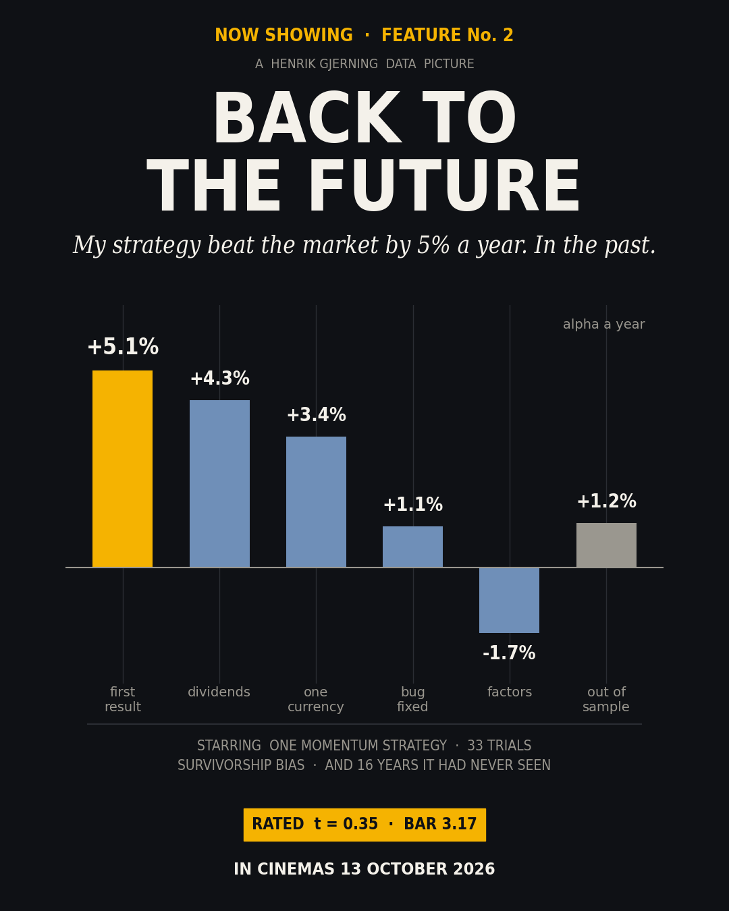
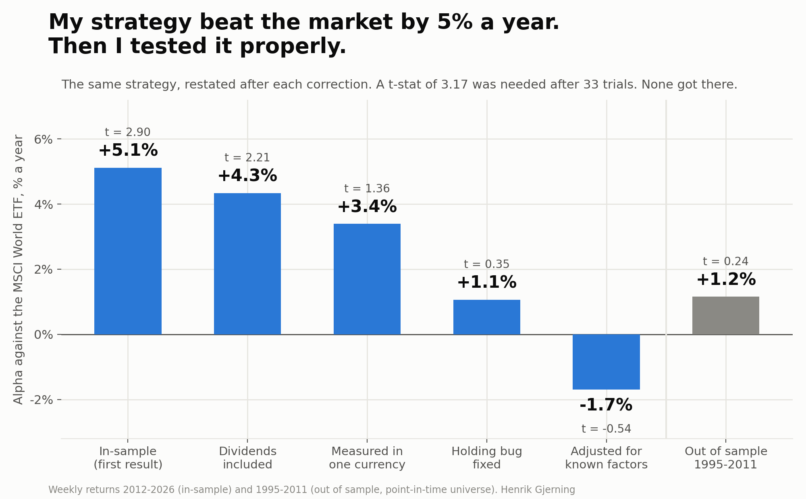
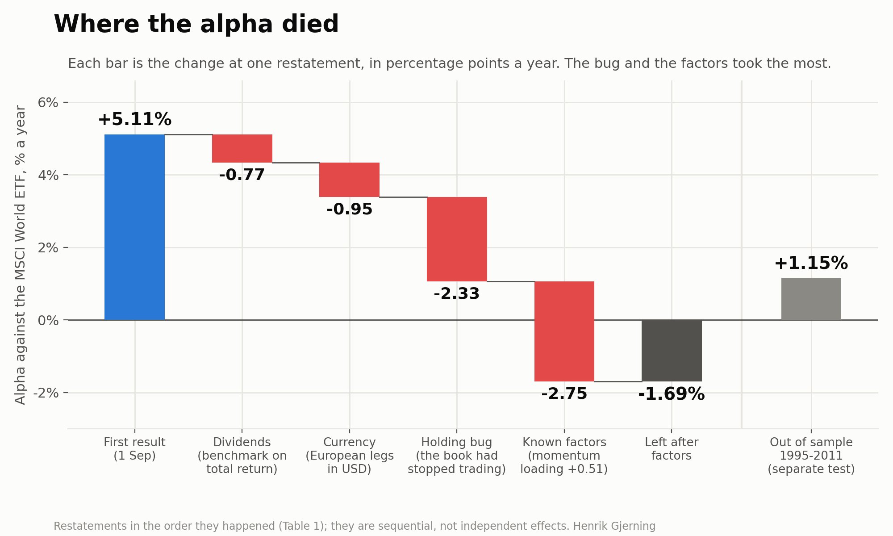
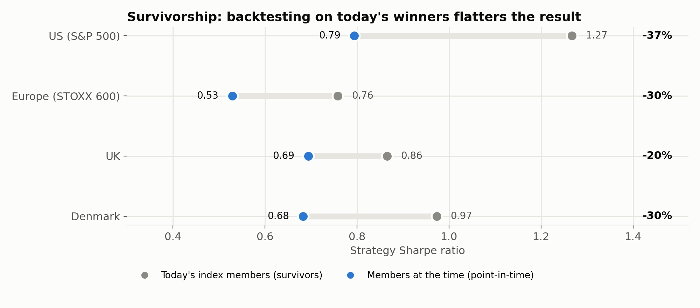
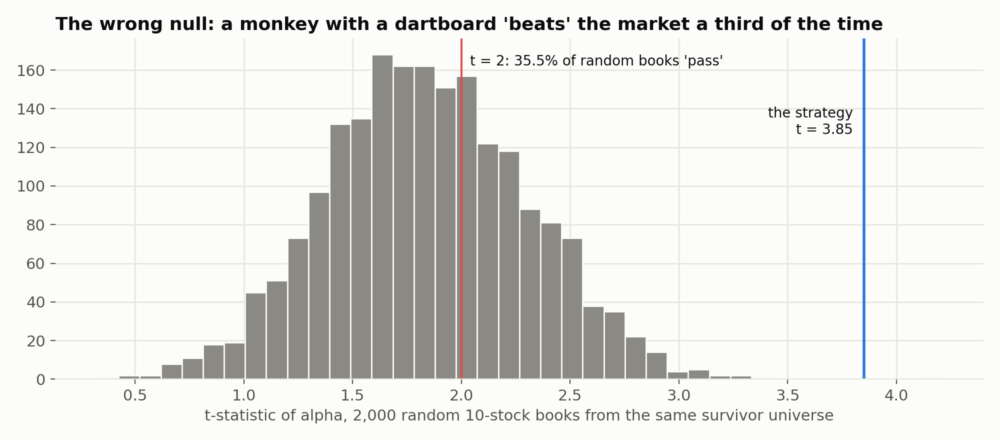
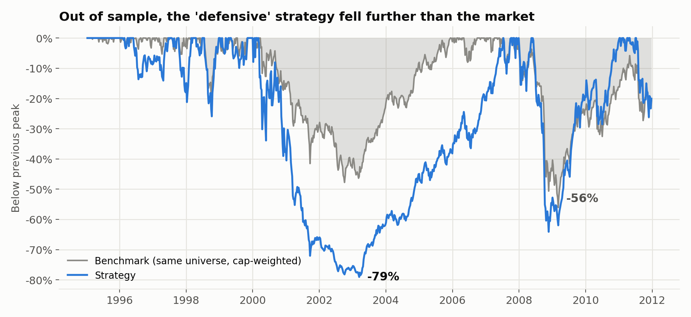
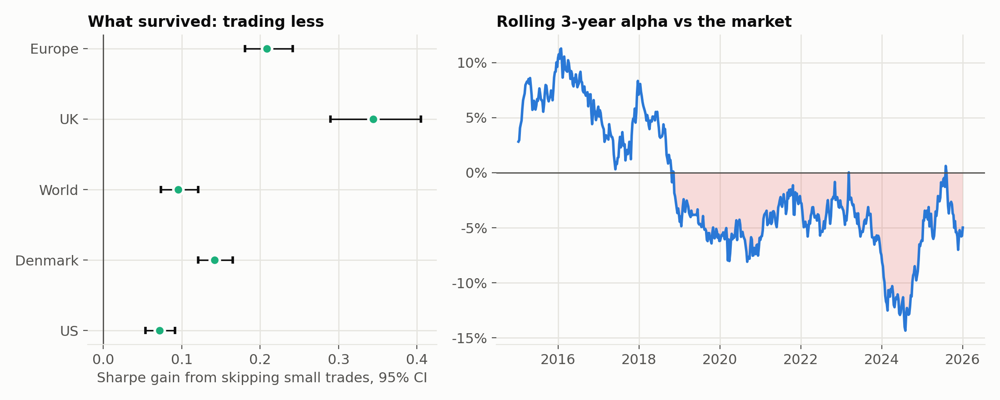

# Back to the Future: my strategy beat the market by 5% a year. In the past.

### One momentum strategy, six honest corrections, and what was left



*Henrik Gjerning · Rude Investment Consulting · September 2026, updated 7 October 2026 · Project 10, Case 33*

*Updated 7 October 2026 after an external review: a figure of where the alpha died, the specification of the factor model, the holding bug in numbers, a clearer note on factor-adjusted versus out-of-sample alpha, more room for the placebo test, and how the trials were counted. No result changed.*

> **In one paragraph.** On 1 September 2026 a weekly momentum strategy I had built showed **+5.1% a year of alpha** against the MSCI World ETF, with a t-statistic of 2.90. Two weeks of checking later, the same strategy's number of record is **+1.1% (t 0.35)**. Adjusted for known factors it is **-1.7%**. On sixteen years of point-in-time data it had never seen, it earned **+1.2% (t 0.24)** with a **-79%** drawdown against the market's -56%. Nothing here was intentional and no data were manipulated. Every correction came from a common backtesting mistake that made the result look better than reality: dividends, currency, a code bug that had quietly turned a momentum strategy into buy-and-hold, survivorship, the wrong null hypothesis, and not counting the trials. The most instructive test was a placebo: among the stocks actually in the index at the time, about one random portfolio in eleven, traded on the strategy's own schedule, did better than the strategy. The haircut, 79%, is in line with what the literature finds for published anomalies and for bank strategies once they go live. The only result that survived was about **trading less**.

**Statistics box.** In-sample: 764 weeks, 2012-01-20 to 2026-09-04. Number of record: alpha +1.06% a year, 95% CI [-4.8%, +7.1%], t 0.35 (block bootstrap) / 0.33 (OLS), beta 0.85. Trials 33, Bonferroni bar t 3.17. Harvey–Liu–Zhu haircut of the first t at 33 trials: 47%. Out of sample: 885 weeks, alpha +1.15%, t 0.24. Cross-sectional placebo z: 4.92 on today's members, 1.34 on point-in-time members.



---

## 1. The result that looked too good

The strategy is a long-only, weekly-rebalanced momentum book. Each week it ranks large-cap stocks in the US and Europe on eight price-only features (12- and 6-month momentum, trend, volatility, short-term reversal and a few more) and holds the ten best per region, weighted by inverse volatility. It pays a measured, realistic commission and prefers names it already holds, to save turnover.

The first regression against the MSCI World ETF, over 2012–2026, gave +5.11% a year, t 2.90, and a Sharpe ratio of 0.945 against the benchmark's 0.695. That is the result a quant hopes for. It is also exactly what the literature warns about. The rest of this article is what happened when I tried to break it.

## 2. The waterfall

**Table 1. The same strategy, restated after each correction**

| # | Date (2026) | Restatement | What changed | Alpha / yr | t (type) | Sharpe: strategy vs benchmark |
|---|---|---|---|---:|---|---|
| 1 | 09-01 | In-sample (price basis) | First regression alpha vs MSCI World ETF; non-US legs and benchmark on price-only closes | **+5.11%** | 2.90 (block bootstrap) | 0.945 vs 0.695 |
| 2 | 09-08 | Total-return re-basing | All legs and the benchmark moved to total return (dividends) | **+4.34%** | 2.21 (block bootstrap) | 0.932 vs 0.819 |
| 3 | 09-11 | Stated in USD | EU legs had been summed in local currencies; restated in the benchmark's currency (measured on the step-2 book) | **+3.39%** | 1.36 (OLS) | 0.874 vs 0.819 |
| 4 | 09-11 | Holding-lock bug fixed (number of record) | A holding bonus had frozen the book into ~40 names held for years; reverted on mechanics | **+1.06%** | 0.35 (block bootstrap) | 0.663 vs 0.819 |
| 5 | 09-12 | Factor-adjusted (13 JKP themes) | Momentum loading +0.51 (t 5.8) explains the rest | **-1.69%** | -0.54 (OLS) | n/a |
| OOS | 09-01 | Out of sample, 1995–2011 | Same rules on a point-in-time universe never used in development | **+1.15%** | 0.24 | 0.475 vs 0.540 |

*The rows are restatements in the order they happened, not additive components: row 3 was measured on the row-2 book, and row 4 is today's number of record. Sources for every row are in `data/waterfall_sources.csv`.*



**Two different questions.** The factor-adjusted figure (-1.7%) and the out-of-sample figure (+1.2%) are not in conflict. The first asks whether any alpha is left in 2012–2025 once the strategy's exposure to known factors, above all momentum, is accounted for. The second asks whether the strategy, run unchanged on sixteen years it never saw, still beat the market at all. Neither found an edge that clears the noise.

### Correction 1: dividends (+5.1% → +4.3%)

The US leg used total-return prices. The European legs, and the benchmark itself, used price-only closes. Mixing the two quietly favours whichever side leaves out dividends, and the benchmark's return rose more when dividends were added: its Sharpe went from 0.695 to 0.819. **Lesson: strategy and benchmark must be on the same return basis, every leg.**

### Correction 2: currency (+4.3% → +3.4%)

European legs were summed in their local currencies (EUR, SEK, DKK, CHF and PLN) as if they had been hedged for free, while the benchmark is an unhedged USD fund. Restated in the benchmark's currency, the alpha fell to +3.4% and the t to 1.36. **Lesson: a return has a currency. Say which one.**

### Correction 3: the holding bug, or a momentum strategy that had stopped trading (→ +1.1%)

To save trading costs, the strategy gives a bonus to stocks it already holds. A parameter search had set that bonus so high that the book barely traded: about forty names over fifteen years, changed in roughly one week in seventeen. It had become a buy-and-hold portfolio of stocks picked early in the sample. Resetting the bonus on mechanical grounds, not on performance, gives today's number of record: **+1.06% a year, t 0.35**. Its Sharpe of 0.663 is now *below* the benchmark's 0.819. Maximum drawdown is -37.6% against -32.7%. I re-derived these from the stored weekly series and they match to the last digit.

> **The holding bug in numbers.** The rule adds a bonus to the score of every stock already held, measured in cross-sectional standard deviations of the score. At 8 standard deviations no newcomer can displace a holding: the best of about 400 candidates sits roughly 2.9 standard deviations above the average, so even a decayed holding keeps its place. The 8 came from a joint parameter sweep picked on in-sample Sharpe (trial 33). The correction went back to 4, the level the project had adopted earlier on principle, and it was chosen from trading mechanics alone: the holding life closest to the momentum signal's own half-life of about 26 weeks. No performance number entered the choice.
>
> | European leg, 765 weeks | Bonus 8 (bugged) | Bonus 4 (corrected) |
> |---|---:|---:|
> | Different names ever held | 36 | 126 |
> | Name changes per week | 0.06 | 0.32 |
> | Weeks with no change at all | 94% | 71% |
> | Average holding life | 168 weeks | 31 weeks |
>
> The US leg looked the same before the fix: 41 names, 95% of weeks without a change, 166 weeks per holding.

### Correction 4: known factors (→ -1.7%)

With the bug fixed, the strategy's momentum loading appears clearly (+0.51, t 5.8, on 13 JKP themes). Regressed on those factors, the alpha is -1.7% (t -0.54). Across four attribution models it lies between −1.7% and +2.9% a year, and every t is below 1. **It is a momentum fund, and momentum is available cheaply.**

> **The factor model, specified.** Weekly returns (Friday to Friday, daily returns compounded), 730 weeks from January 2012 to December 2025, where the factor data end. Dependent variable: the book's return in USD minus the US Treasury bill rate. Regressors: the JKP world market excess return and the 13 JKP world theme factors (accruals, debt issuance, investment, low leverage, low risk, momentum, profit growth, profitability, quality, seasonality, short-term reversal, size, value), each a capped value-weighted long-short return in USD (Jensen, Kelly & Pedersen, 2023). Ordinary least squares with an intercept; t-statistics use Newey-West standard errors with four lags. The intercept times 52 is the alpha. R² 0.54. The themes are correlated, so only the alpha and the momentum loading are read. The other three models: French six factors on developed markets (−0.72%, t −0.26), 20 clusters of the 153 JKP factors (+0.08%, t 0.03) and the JKP market alone (+2.93%, t 0.94). Code: `run_jkp_country_benchmarks.py` and `run_factor_attribution.py` in Project 2.

## 3. Survivorship: backtesting on today's winners

The easiest universe to download is today's index. It is also the most dangerous. Every stock in it survived to be there, and a momentum strategy is especially good at finding the ones that went on to survive.

**Table 2. The same strategy on today's members vs members at the time**

| Universe | Sharpe on today's members | Sharpe on members at the time | Overstatement | Method |
|---|---:|---:|---:|---|
| US (S&P 500) | 1.267 | 0.794 | +60% (haircut 37%) | today's members vs point-in-time members, Sharadar |
| Europe (STOXX 600) | 0.758 | 0.529 | +43% (haircut 30%) | same panel, point-in-time mask off vs on |
| UK | 0.865 | 0.694 | +25% (haircut 20%) | current members vs point-in-time |
| Denmark | 0.973 | 0.683 | +43% (haircut 30%) | current members vs point-in-time; small, noisy |



The haircut ranges from 20% to 37% of the Sharpe ratio. The effect is even larger on a placebo test, and the placebo is the most instructive test in this article.

### The placebo: random stocks, the strategy's own schedule

Most investors know about survivorship and overfitting. Fewer ask what random portfolios in the same universe would have done with the same trading pattern. The placebo replays the strategy's exact holding schedule, the same number of names and the same dates in and out, but with randomly chosen stocks. On today's index members the strategy looked extraordinary against its placebos (z = 4.92). On members at the time it sits at the 91st percentile (z = 1.34): about one random portfolio in eleven did better. The placebo names are drawn at random from the same universe, not matched on sector, size or volatility, so this is a slightly easier bar than a matched placebo would be. Survivorship and momentum interact. Among survivors, past winners are disproportionately the names that kept winning, so the same test on the convenient universe inflates the answer about 3.7 times.

## 4. The wrong null: a dartboard beats the market

A common way to judge a stock-picking strategy is to ask whether its alpha is significantly above zero. But zero is the wrong benchmark when the universe itself is biased. I drew 2,000 random ten-stock books from the same survivor universe and measured their alpha the same way.



The random books averaged a t of 1.84 and 35.5% of them cleared t > 2. The strategy's own t of 3.85 beat almost all of them (0.05% did better). That test was run on the frozen, bugged book, and it shows how much apparent skill the universe hands out for free. **Lesson: test against random portfolios drawn from the same universe, not against zero.**

## 5. Out of sample: sixteen years the strategy had never seen

Before looking, I registered one test. The same rules would run on a point-in-time database of European and American large caps, 1995–2011, a period the strategy had never touched. The pass rule was t > 2.

**Table 3. The out-of-sample test**

| | Strategy | Benchmark |
|---|---:|---:|
| Period, weeks | 1995-01-13 to 2011-12-23, 885 | same |
| CAGR | +9.6% | +8.6% |
| Sharpe | 0.475 | 0.540 |
| Maximum drawdown | **-79.1%** | -56.1% |
| Beta to benchmark | 1.18 | 1.00 |
| Alpha / yr, 95% CI (record) | **+1.15%** [-8.1%, +10.6%], t 0.24 | |
| Alpha / yr, plain OLS (re-derived here) | +1.15%, t 0.29 | |
| Europe leg alone | +0.31%, t 0.05 | |
| America leg alone | +2.30%, t 0.34 | |

*Benchmark: cap-weighted return of the same point-in-time universe (top 600 Europe, top 500 America), equal-weighted across the two regions, as pre-registered. The strategy ends with more wealth than the benchmark only because it carried more market risk (beta 1.18); per unit of risk it lost.*



It did not replicate. The in-sample drawdown advantage also disappeared. The 2012–2026 window contains no full bear market, and 1995–2011 contains two. A strategy that looked defensive in-sample lost 79% peak to trough, far more than the market.

## 6. Counting the trials

Every choice you make after seeing the data (a feature, a lookback, a region, a parameter) is another draw from the lottery. This project counted them: 33 pre-registered trials by the time of the last correction. The count follows one rule: every pre-registered hypothesis that decided something is a trial, whether it passed or failed. It is a floor, not a ceiling. A parameter sweep counts as one trial (trial 33 was a 7-by-7 grid), and looks at the data that never became a registered test are not counted.

**Table 4. What t is needed when you have tried N things**

| Number of strategies tried | t needed (Bonferroni, 5% two-sided) | Does t = 2.90 clear it? |
|---:|---:|---|
| 1 | 1.96 | yes |
| 5 | 2.58 | yes |
| 13 | 2.89 | yes |
| 24 | 3.08 | no |
| 33 | 3.17 | no |
| 100 | 3.48 | no |
| 235 | 3.70 | no |

The first t of 2.90 would have survived only up to 13 trials. The Harvey, Liu & Zhu (2016) Bonferroni haircut at 33 trials takes the t to 1.54, a 47% haircut to the Sharpe ratio, before any of the corrections above. The deflated Sharpe ratio of the best of the first 24 variants (Bailey & López de Prado, 2014) was 0.9359, below the 0.95 threshold. **Lesson: write the count down before you start, and raise the bar with it.**

## 7. How typical is this? Relevance statistics

**Table 5. This strategy's haircut against the literature**

| Study | Sample | Finding | Haircut |
|---|---|---|---:|
| McLean & Pontiff (2016) | 97 published anomalies | Returns lower out of sample (before publication) | 26% |
| McLean & Pontiff (2016) | 97 published anomalies | Returns lower after publication | 58% |
| Suhonen, Lennkh & Perez (2017) | 215 alternative-beta strategies from 15 banks | Median Sharpe decline from backtest to live | 73% |
| Hou, Xue & Zhang (2020) | 452 anomalies | Share failing |t| >= 1.96 once microcaps are controlled | 65% |
| Hou, Xue & Zhang (2020) | 452 anomalies | Share failing a multiple-testing hurdle of t >= 2.78 | 82% |
| Wiecki et al. (2016) | 888 algorithms on Quantopian | Backtest Sharpe explains less than 2.5% of live Sharpe (R-squared) |  |
| **This strategy** | one momentum book, 2012–2026 | alpha, first result → number of record | **79%** |
| **This strategy** | same | alpha, first result → out of sample | **77%** |
| **This strategy** | same | Sharpe, first result → number of record | **30%** |

A 79% alpha haircut sounds dramatic. It is ordinary. McLean & Pontiff find published anomalies lose 58% of their return after publication. Suhonen, Lennkh & Perez find bank-marketed alternative-beta strategies lose a median 73% of their backtested Sharpe once live. Hou, Xue & Zhang fail most of 452 anomalies on a clean replication. Wiecki et al. find that a backtest's Sharpe barely predicts its live Sharpe. On that evidence, **the right prior for any backtest is that most of it will go**. This one went slightly faster than average, because each correction here was cheap to make.

## 8. What survived: trading less

One result cleared every test I put to it. The strategy skips trades below a fixed size (a no-trade band), and that measurably improves its Sharpe ratio in every region.

**Table 6. The no-trade band**

| Region | Sharpe gain from the band | 95% CI (paired block bootstrap) |
|---|---:|---|
| Europe | +0.209 | [+0.181, +0.242] |
| UK | +0.344 | [+0.290, +0.405] |
| World | +0.096 | [+0.073, +0.121] |
| Denmark | +0.142 | [+0.121, +0.165] |
| US | +0.071 | [+0.054, +0.091] |
| **Book (50/50 US/Europe)** | **+0.160** | [+0.137, +0.186] |



It is not selection skill. It is cost control: the same strategy, run with less churn. Compared with an index fund, the strategy still has nothing to show. Its rolling three-year alpha has been negative in 99% of weeks since 2019 and stood at -5.0% at the last reading (2026-01-02).

So the strategy did not survive as a source of alpha; the cost control did. The main discovery was not how to beat the market, but how easy it is to believe you already have.

## 9. A checklist before you believe a backtest

1. **Same return basis** for every leg and the benchmark (total return, same currency).
2. **Point-in-time universe:** the index as it was, including the names that later died.
3. **Clean data:** one bad split (a 1:1000 reverse split read as +107,385% in a week) was held by this momentum strategy for 63 weeks.
4. **The right null:** random portfolios from the same universe, not zero.
5. **Count every trial** and raise the t-bar with it; report the deflated Sharpe.
6. **Test on untouched data** with a rule written down before looking.
7. **Report the drawdown path**, not only the Sharpe, and a sample with a bear market in it.

## 10. Caveats

- This is one strategy. The corrections are general, but their sizes are not.
- The point-in-time European universe is itself incomplete (26% of historical names lack prices), so its survivorship estimate is a lower bound.
- The out-of-sample period (1995–2011) comes from a licensed database. Only summary statistics and charts are published, not the series.
- Currency restatement was measured on the pre-fix book (row 3 of Table 1).
- **Regime.** The in-sample window, 2012–2026, was kind to momentum and has no full bear market. The corrections are measured inside it, so the article cannot separate how much of the first +5.1% was error and how much was a friendly regime. The out-of-sample period, with two bear markets, is the check on that, and the strategy failed it.
- **Not run:** White's Reality Check and Hansen's test of superior predictive ability on the 33 variants together. They would ask the multiple-testing question more sharply than Bonferroni. The corrected strategy does not clear even the uncorrected bar (t 0.35), so I do not expect them to change the answer.
- **A fair referee's summary:** the contribution is educational rather than scientific. The biases are known one by one; what is rarer is an end-to-end case of how several modest corrections combine to remove an apparently significant result. The evidence for the strategy is weak. The evidence for the dangers of backtesting is much stronger.

## Reproduce

```bash
python code/analyse.py         # re-derives the numbers of record, writes results/summary.json
python code/make_figures.py    # figures/
python code/build_article.py   # this article and the LinkedIn teaser
python code/make_pdfs.py       # PDFs
```

The weekly return series live in `data_private/` and are not published: they derive from licensed data. Everything else (summary files, sources for each number, code) is in the repository.

## References

- Bailey, D. H. & López de Prado, M. (2014). The deflated Sharpe ratio: correcting for selection bias, backtest overfitting and non-normality. *Journal of Portfolio Management*, 40(5).
- Brown, S. J., Goetzmann, W., Ibbotson, R. G. & Ross, S. A. (1992). Survivorship bias in performance studies. *Review of Financial Studies*, 5(4).
- Harvey, C. R., Liu, Y. & Zhu, H. (2016). … and the cross-section of expected returns. *Review of Financial Studies*, 29(1).
- Hou, K., Xue, C. & Zhang, L. (2020). Replicating anomalies. *Review of Financial Studies*, 33(5).
- Jensen, T. I., Kelly, B. & Pedersen, L. H. (2023). Is there a replication crisis in finance? *Journal of Finance*, 78(5).
- Jegadeesh, N. & Titman, S. (1993). Returns to buying winners and selling losers. *Journal of Finance*, 48(1).
- McLean, R. D. & Pontiff, J. (2016). Does academic research destroy stock return predictability? *Journal of Finance*, 71(1).
- Gârleanu, N. & Pedersen, L. H. (2013). Dynamic trading with predictable returns and transaction costs. *Journal of Finance*, 68(6).
- Novy-Marx, R. & Velikov, M. (2016). A taxonomy of anomalies and their trading costs. *Review of Financial Studies*, 29(1).
- Suhonen, A., Lennkh, M. & Perez, F. (2017). Quantifying backtest overfitting in alternative beta strategies. *Journal of Portfolio Management*, 43(2).
- Wiecki, T., Campbell, A., Lent, J. & Stauth, J. (2016). All that glitters is not gold: comparing backtest and out-of-sample performance on a large cohort of trading algorithms. *Journal of Investing*, 25(3).
- White, H. (2000). A reality check for data snooping. *Econometrica*, 68(5).

*Not investment advice.*
