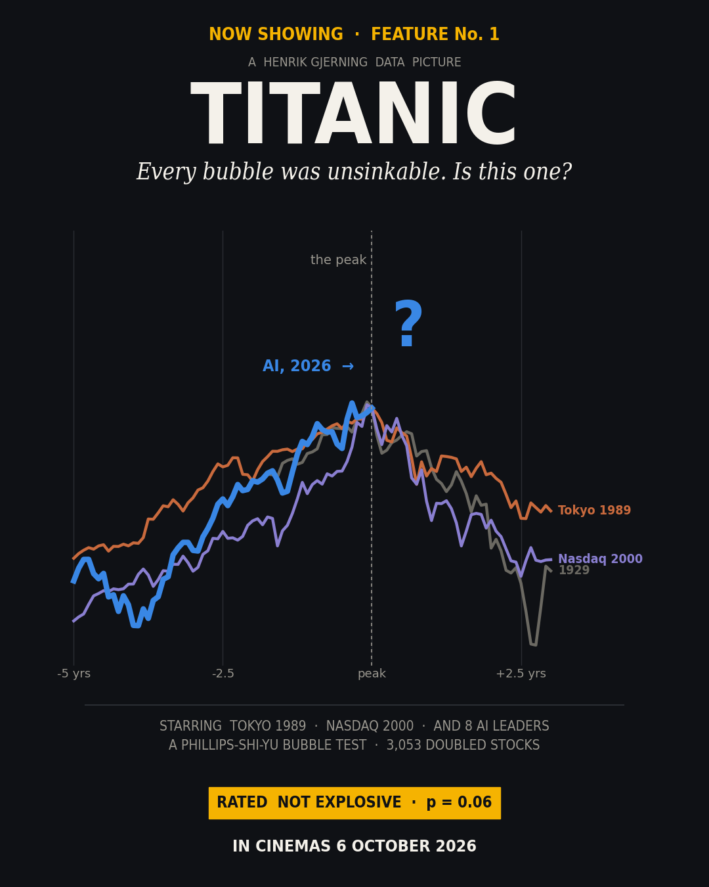
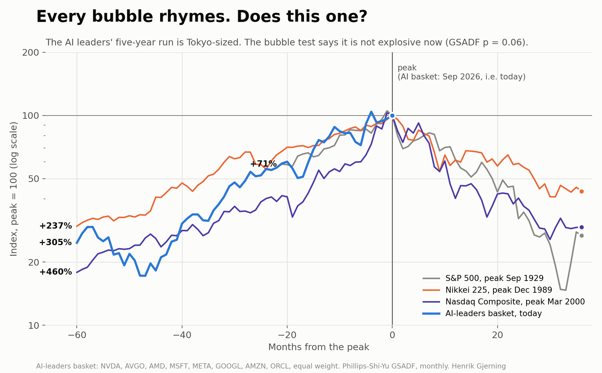
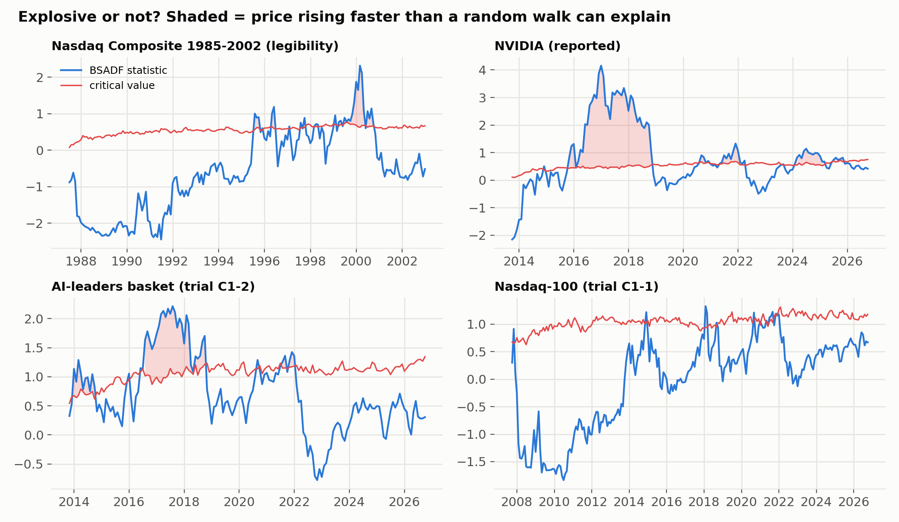
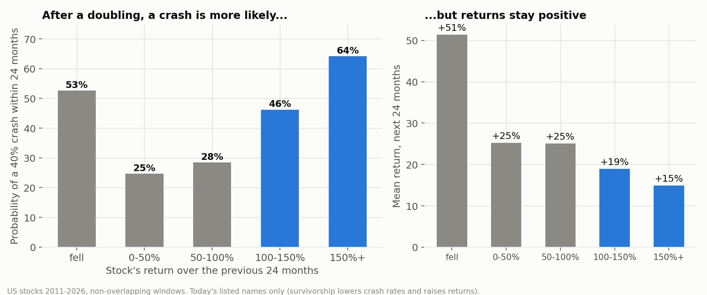
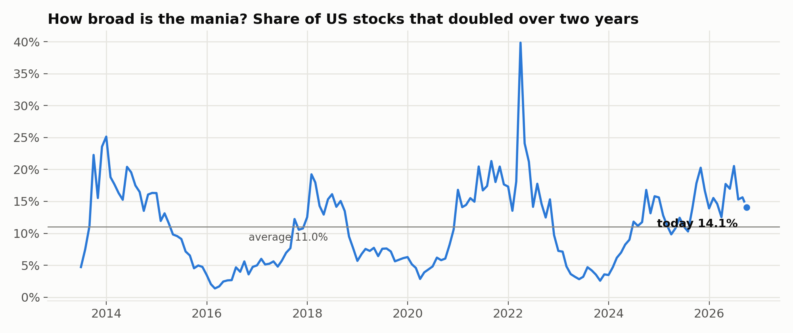

# Titanic: every bubble was unsinkable. Is this one?

### A pre-registered bubble test of the AI boom, against Tokyo 1989, Nasdaq 2000 and 1929



*Henrik Gjerning · Rude Investment Consulting · September 2026, updated 7 October 2026 · Project 10, Case 1*

*Updated 7 October 2026 after an external review: a valuation table (section 8), a box on why these eight names, a plain reading of the basket's p value, and a clearer conclusion. No pre-registered number changed.*

> **In one paragraph.** Over the last five years an equal-weight basket of eight AI leaders rose **+305%**. The Nikkei rose +237% into its 1989 peak and the Nasdaq Composite +460% into March 2000. The gains are bubble-sized. I tested whether the *shape* is bubble-like with the Phillips–Shi–Yu GSADF test, which asks whether a price rises faster than any random walk can explain. The test dates Tokyo 1989 and Nasdaq 2000 in real time; it misses 1929 only because my data start 21 months before that peak. **Pre-registered result: neither the Nasdaq-100 nor the AI basket is explosive now** (basket GSADF p = 0.06, and no explosive phase since 2021). Under this definition of a bubble, there is no evidence of an active one. That is not the same as proof that there is none. NVIDIA alone was explosive in 2024–25 and has since cooled. The second, older fact about bubbles holds strongly. Among 3,053 US stocks that doubled in two years, **48% then fell 40%** within the next two, against 38% for all stocks. Yet their average returns afterwards stayed positive. Three of the eight AI names meet that doubling test today. On valuation, the eight trade at 26 times earnings against 83 for the tech leaders of March 2000, but at the same free-cash-flow yield (1.4%), because they now spend a quarter of their sales on investment.

**Statistics box.** Trials 3 (Bonferroni: 98.33% critical values; p < 0.0167). C1-1 Nasdaq-100: GSADF 1.33 vs 2.71, fail. C1-2 AI basket: GSADF 2.21 vs 2.80 (MC p 0.062), fail. C1-3 crash probability after a doubling: 48.0% vs 38.3%, z 9.6, **pass**, both halves. Legibility: 2 of 3 historic bubbles dated. Monte Carlo critical values: 2,000 draws per sample length, seed 42. Programme trial count: 20. Valuation (section 8): reported, not gated.



*Figure 1. Every episode is aligned at its peak. Today is placed at the peak by assumption, not because the data show one. The chart says nothing about whether the AI basket has peaked.*

---

## 1. Why ask, and why now

Whether AI is a bubble is the market question of 2026. Most answers are analogies: price charts overlaid on 1999, or valuation multiples set against Cisco. Analogies rhyme by construction, because any strong rally looks like the first half of a bubble. This article instead applies the two most-tested empirical definitions of a bubble. Before running anything, it writes down what would count as a yes.

**Definition 1: explosiveness.** Under rational pricing, a log price should behave at worst like a random walk with drift. A bubble makes it grow *explosively*, faster than any such walk. Phillips, Wu & Yu (2011) and Phillips, Shi & Yu (2015) built recursive right-tailed unit-root tests (SADF, GSADF) that detect this and date it in real time. The BSADF statistic at each month uses only data up to that month.

**Definition 2: what happens after a run-up.** Fama (2014) argues that "bubble" should mean *predictably* negative returns after a run-up. Greenwood, Shleifer & You (2019, "Bubbles for Fama") tested this on US industries since 1926. A 100% two-year run-up does not predict negative average returns, but it sharply raises the probability of a crash, and acceleration, volatility and issuance raise it further.

## 2. Pre-registration

The specification (`PREREGISTRATION_C1_2026-09-25.md`) was written before any statistic was computed. It fixes the series, the AI basket's eight members, the lag, the Monte Carlo, three trials with a Bonferroni gate, and a **legibility check**. The legibility check says the tool must date at least two of three known bubbles, or its verdict on AI is not read. My predictions:

- C1-1 (Nasdaq-100 explosive now) fails.
- C1-2 (AI basket explosive now) is about 50/50.
- C1-3 (crash probability after a doubling) passes.
- Returns after run-ups are not significantly lower.

> **Why these eight?** NVIDIA, Broadcom, AMD, Microsoft, Meta, Alphabet, Amazon and Oracle: the largest US-listed companies whose business is directly tied to the AI build-out, in chips, cloud capacity or models. They were fixed in the pre-registration before any statistic was computed, held at equal weight and rebalanced monthly. The choice is deliberately imperfect. Picking today's leaders after the fact favours finding bubble-like behaviour, because the winners are chosen once their run is known. A cleaner basket would have been fixed years ago. So the fact that the test finds no explosive phase now, despite a selection that leans towards one, counts against the bubble reading, not for it. It is also narrow. The AI boom reaches well beyond eight listed giants: software, chip-equipment makers, data-centre landlords, power utilities and private and venture-funded companies are all part of it, and none is in this test. A broader basket is the natural extension.

## 3. Can the test recognise a bubble?

**Table 1. Legibility: dating the famous three**

| Episode | Months | GSADF | 95% critical value | Explosive phase(s) dated by BSADF | Covers peak − 3 months? | Verdict |
|---|---:|---:|---:|---|---|---|
| S&P 500 1927-1934 (peak 1929-09) | 85 | 2.07 | 2.16 | 1932-03 → 1932-06 | no (1929-06) | **fail** |
| Nikkei 225 1970-1992 (peak 1989-12) | 276 | 2.86 | 2.39 | 1972-10 → 1973-03; 1984-01 → 1984-04; 1984-08 → 1990-07 | yes (1989-09) | **pass** |
| Nasdaq Composite 1985-2002 (peak 2000-03) | 216 | 2.32 | 2.27 | 1995-07 → 1995-09; 1998-02 → 1998-04; 1999-06 → 2000-04; 2000-06 → 2000-09 | yes (1999-12) | **pass** |

The test dates Tokyo from 1984 to mid-1990 and the Nasdaq from June 1999 to April 2000, before both peaks. It **misses 1929**. My S&P 500 series starts in December 1927, only 21 months before the peak, which is shorter than the test's minimum window at that sample size. It flags the 1932 rebound instead. The pre-registration allows one miss.



## 4. Is the AI boom explosive now?

**Table 2. The trials, plus two reported series**

| Trial | Series | Sample | GSADF | Critical value (98.33%) | MC p | BSADF, last month | Critical value, last month | Explosive episodes dated | Verdict |
|---|---|---|---:|---:|---:|---:|---:|---|---|
| C1-1 | Nasdaq-100 (QQQ) | 2005-01 → 2026-09 | 1.33 | 2.71 | 0.413 | 0.67 | 1.18 | 2021-04 → 2021-08 | fail |
| C1-2 | AI-leaders basket | 2011-07 → 2026-09 | 2.21 | 2.80 | 0.062 | 0.31 | 1.34 | 2013-12 → 2014-09; 2016-07 → 2018-09; 2021-10 → 2021-12 | fail |
| (reported) | NVIDIA | 2011-06 → 2026-09 | 4.16 | 2.28 (95%) | 0.000 | 0.41 | 0.75 | 2015-10 → 2018-10; 2020-08 → 2020-11; 2021-04 → 2022-03; 2024-01 → 2025-02; 2025-06 → 2025-10 | explosive before, not now |
| (reported) | S&P 500 | 2005-01 → 2026-09 | 1.34 | 2.29 (95%) | 0.403 | 0.76 | 0.73 | 2017-12 → 2018-02; 2026-04 → 2026-09 | a flicker, not a pass |

**Neither trial passes.** The basket's p of 0.062 deserves one plain sentence, because it invites the reading "almost significant". Its statistic is higher than in about 94% of random-walk simulations, so the path is unusual. But it clears neither the pre-registered threshold (98.33%) nor the conventional 95% one. The AI basket's explosive phases, as the test dates them, were 2013–14, 2016–18 and late 2021, not 2023–26. That sounds wrong until you look at the arithmetic. The basket compounded quickly for the whole fifteen years, so its recent gains are large but not *faster than its own history*. That is what explosiveness measures. NVIDIA is the one name that did go explosive in this cycle, twice in 2024–25, and its BSADF has since fallen back below the critical value. The S&P 500 shows a six-month flicker above its 95% line since April 2026. With a whole-sample GSADF p of 0.40, that is a watch item, not a result.

Robustness: with 0 lags instead of 1, and at the 95% level instead of 98.33%, the trial verdicts are unchanged.

## 5. The rhyme, and what it assumes

**Table 3. Sixty months into the peak, and after**

| Episode | Rise over the 60 months into the peak | 12 months after | 36 months after | Worst point within 36 months |
|---|---:|---:|---:|---:|
| S&P 500, peak Sep 1929 | +71% (only 21 months of data) | -38% | -73% | -85% |
| Nikkei 225, peak Dec 1989 | +237% | -39% | -57% | -59% |
| Nasdaq Composite, peak Mar 2000 | +460% | -60% | -71% | -74% |
| AI-leaders basket, today | +305% | n/a | n/a | n/a |


The hero chart aligns every episode at its peak and treats *today* as the AI basket's peak. That is the worst case for AI by construction, and it is what analogy charts do without saying so. On the way up the AI run sits between Tokyo and the Nasdaq. What followed the historic peaks was a 57–85% fall within three years. **The chart cannot tell you whether today is a peak. Only the explosiveness test addresses that, and it says the shape of the last three years is not the shape of 1989 or 1999.**

## 6. What happens after a run-up: Greenwood–Shleifer–You on US stocks

**Table 4. Trial C1-3, crash probability after a doubling**

| | Two-year run-up before the event | Crash probability (40% fall within 24 months) | n | z | p (one-sided) |
|---|---|---:|---:|---:|---:|
| **C1-3** | ≥ 100% | **48.0%** vs 38.3% | 3,053 vs 10,954 | 9.6 | 3.4e-22 |
| 2013–2019 events | ≥ 100% | 39.9% vs 32.2% | 1,430 vs 6,406 | 5.6 | 1.1e-08 |
| 2020–2024 events | ≥ 100% | 55.0% vs 46.9% | 1,623 vs 4,548 | 5.6 | 8.8e-09 |
| reported | ≥ 150% | 58.2% vs 38.3% | 1,805 vs 10,954 | 15.9 | 3.1e-57 |

**Table 5. By size of the run-up (reported)**

| Two-year return | n | Crash probability | Mean 24-month return after |
|---|---:|---:|---:|
| fell | 3,863 | 53% | +51% |
| 0 to 50% | 4,294 | 25% | +25% |
| 50 to 100% | 1,667 | 28% | +25% |
| 100 to 150% | 526 | 46% | +19% |
| 150% or more | 603 | 64% | +15% |



**Table 6. Returns and characteristics after a doubling (reported)**

| After a ≥100% run-up vs all windows | Event | Control | Welch t | p |
|---|---:|---:|---:|---:|
| Mean return, next 12 months | +11.9% | +16.4% | -2.26 | 0.024 |
| Mean return, next 24 months | +23.1% | +33.8% | -4.31 | 1.6e-05 |
| Median return, next 24 months | +4.2% | +15.1% | | |
| Crash probability, high vs low **acceleration** (share of the run-up earned in the last 12 months) | 53% | 43% | | |
| Crash probability, high vs low **volatility** | 68% | 28% | | |

This replicates GSY's central finding at the stock level. After a doubling, the chance of a 40% crash is materially higher, and higher still after a 150% run and in fast-accelerating, high-volatility names. Their second finding needs a qualifier. Returns after a run-up are **not negative**: the mean was +23% over 24 months. But they are significantly **lower** than for other stocks, and the median is only +4%. **My prediction that they would not differ was wrong.**

Two cautions. First, the panel contains only today's listed stocks. Firms that crashed and were delisted are missing, so crash rates are understated and forward returns overstated. Second, a 40% drawdown is partly a volatility measure: the "fell" bucket crashes often too, because falling stocks are volatile stocks.

## 7. Relevance: the AI names today, and how broad the mania is

**Table 7. The eight AI leaders, as of 2026-09**

| Name | 24-month return | 12-month return | From peak | Peak month | Historical crash rate for this run-up bucket |
|---|---:|---:|---:|---|---:|
| NVIDIA | +83% | +19% | +0% | 2026-09 | 28% |
| Broadcom | +111% | +9% | -20% | 2026-05 | 46% |
| AMD | +241% | +246% | -4% | 2026-06 | 64% |
| Microsoft | +17% | -4% | -7% | 2025-07 | 25% |
| Meta | +17% | -9% | -14% | 2025-07 | 25% |
| Alphabet | +112% | +44% | -9% | 2026-04 | 46% |
| Amazon | +36% | +16% | -7% | 2026-07 | 25% |
| Oracle | -11% | -47% | -47% | 2025-09 | 53% |
| Nasdaq-100 (QQQ) | +49% | +21% | -2% | 2026-05 | n/a (index) |
| S&P 500 (SPY) | +35% | +15% | -1% | 2026-08 | n/a (index) |
| **AI-leaders basket** | +80% | +26% | -4% | 2026-05 | n/a (index) |

By the GSY yardstick, the names that meet the doubling test are AMD (+241%), Alphabet (+112%), Broadcom (+111%). In the panel, stocks with run-ups like these went on to fall 40% within two years in 46–64% of cases. The basket itself (+80% over 24 months, -4% from its peak) does not meet it.



**Breadth.** GSY also find that bubbles come with broad participation and new issuance. Today 14.1% of the US stocks in the panel have doubled over two years. The panel average is 11.0%, and the peak was 40% in 2022-03, the post-Covid rebound. The market is above its average, but nowhere near a broad mania.

## 8. Expensive? A valuation check (added 7 October 2026)

The explosiveness test looks only at prices. A fund manager's first question is a different one: fine, not explosive, but is it expensive? Table 8 sets the eight against the largest tech names at the Nasdaq peak on 10 March 2000: Cisco, Microsoft, Oracle, Intel and, for scale, a much smaller NVIDIA. Reported, not gated.

**Table 8. The eight today against the tech leaders of March 2000**

| Company | Market value (USD bn) | Price / sales | Price / earnings | Free-cash-flow yield | Revenue growth (1 yr) | Net margin | Capex / revenue |
|---|---:|---:|---:|---:|---:|---:|---:|
| ***The eight AI leaders, 2026-09-30*** | | | | | | | |
| NVIDIA | 5,510 | 18.2 | 29 | 2.3% | +83% | 64% | 2% |
| Broadcom | 1,677 | 22.2 | 57 | 2.0% | +32% | 39% | 1% |
| AMD | 999 | 24.2 | 155 | 0.8% | +40% | 16% | 4% |
| Microsoft | 3,816 | 11.5 | 29 | 1.8% | +18% | 40% | 35% |
| Meta | 1,849 | 8.1 | 27 | 2.2% | +28% | 30% | 39% |
| Alphabet | 4,211 | 9.4 | 17 | 1.3% | +20% | 55% | 30% |
| Amazon | 2,687 | 3.5 | 20 | -0.3% | +16% | 17% | 22% |
| Oracle | 397 | 5.9 | 23 | -6.0% | +17% | 25% | 83% |
| **All eight, as one company** | 21,145 | 9.3 | 26 | 1.4% | +25% | 36% | 25% |
| ***Tech leaders at the Nasdaq peak, 2000-03-10*** | | | | | | | |
| Cisco (2000) | 467 | 34.7 | 231 | 0.9% | +46% | 15% | 5% |
| Microsoft (2000) | 526 | 23.5 | 60 | 1.7% | +34% | 39% | 3% |
| Oracle (2000) | 230 | 24.7 | 160 | 0.7% | +17% | 15% | 3% |
| Intel (2000) | 402 | 14.0 | 55 | 2.1% | +14% | 25% | 11% |
| NVIDIA (2000) | 4 | 11.7 | 117 | 0.0% | n/a | 10% | 4% |
| **All five, as one company** | 1,628 | 21.9 | 83 | 1.4% | +25% | 26% | 6% |

*Trailing four quarters known on the date (filing date on or before it). Market value at the latest filing, moved with the share price to the date. 'As one company' sums market values, sales, earnings and cash flows, so the large names weigh in proportion. Source: Sharadar SF1 and SEP (licensed; only the ratios are published).*

**On earnings, far cheaper than 2000.** As one company, the eight trade at 26 times trailing earnings and 9.3 times sales. The five leaders of March 2000 traded at 83 and 21.9; Cisco alone at 231 times earnings. Today's leaders also keep more of each dollar of sales: a net margin of 36% against 26%. Revenue grew 25% over the last year, as it did for the 2000 leaders (25%).

**On free cash flow, as expensive as 2000.** The free-cash-flow yield is 1.4%, the same as in March 2000 (1.4%). The difference is investment. The eight spend 25% of their sales on capital expenditure, against 6% for the 2000 leaders. Oracle spends 83% of its sales, and Amazon's and Oracle's free cash flow is negative. The earnings are real. Whether the data-centre spending will earn its cost of capital is the open question.

**What this adds.** The AI leaders are expensive (26 times earnings is well above the US market's long-run average in the mid-teens), but not on the scale of 2000, and unlike in 2000 the profits are there. The valuation question is therefore not whether cash flows exist, but whether today's investment will produce enough of them. That calls for a different tool, a reverse discounted-cash-flow model ("what growth is already priced in?"), which I will take up in a separate article.

*Caveats: one date for each episode; trailing figures; net income includes one-off items (Alphabet's margin appears lifted by non-operating gains); the 2000 group is the largest names, not the whole bubble, where many companies had no earnings at all.*

## 9. What this does and does not show

- **A price test.** The trials use prices only; section 8 adds a valuation snapshot, not a valuation test. PSY originally applied the test to the price-dividend ratio. On log prices the test can confuse a strong fundamental trend with a bubble, and here it did the opposite: it declined to call one.
- **The AI basket was chosen ex post** as today's leaders. That biases *towards* finding a bubble, and none was found.
- **One legibility miss** (1929), explained by the data window.
- **Survivorship** in the stock panel understates crash rates.
- **Not a timing signal.** An explosiveness test says whether a price path is unusual, not when it ends.

## 10. So, does this one rhyme?

In size, yes: five years, +300%, between Tokyo and the Nasdaq. In shape, not yet: the statistic that dated both of those bubbles in real time does not fire on the AI basket or the Nasdaq-100 today. What the data do say is that individual names after a doubling carry crash risk of roughly one in two. That is a statement about position sizing, not about the index.

Put precisely: under the GSADF definition, there is no evidence of an active bubble in the AI basket or the Nasdaq-100 today. A bubble that has not yet turned explosive, or one that sits in valuations rather than in the price path, is not ruled out. On earnings the eight are far cheaper than the leaders of 2000. On free cash flow they are not, because of the investment boom. If there is a reckoning, the place to look is the return on that investment.

## Reproduce

```bash
python code/run_bubbles.py      # legibility, C1-1, C1-2, C1-3 (about 4 minutes, Monte Carlo)
python code/reported_extra.py   # NVIDIA and AMD, rhyme paths
python code/valuation_table.py  # section 8 (needs the licensed Sharadar cache)
python code/make_figures.py && python code/build_article.py && python code/make_pdfs.py
```

## References

- Brunnermeier, M. K. & Nagel, S. (2004). Hedge funds and the technology bubble. *Journal of Finance*, 59(5).
- Diba, B. T. & Grossman, H. I. (1988). Explosive rational bubbles in stock prices? *American Economic Review*, 78(3).
- Fama, E. F. (2014). Two pillars of asset pricing. *American Economic Review*, 104(6).
- Greenwood, R., Shleifer, A. & You, Y. (2019). Bubbles for Fama. *Journal of Financial Economics*, 131(1).
- Homm, U. & Breitung, J. (2012). Testing for speculative bubbles in stock markets: a comparison of alternative methods. *Journal of Financial Econometrics*, 10(1).
- Kindleberger, C. P. & Aliber, R. Z. (2011). *Manias, Panics and Crashes* (6th ed.). Palgrave Macmillan.
- Ofek, E. & Richardson, M. (2003). DotCom mania: the rise and fall of internet stock prices. *Journal of Finance*, 58(3).
- Pástor, Ľ. & Veronesi, P. (2009). Technological revolutions and stock prices. *American Economic Review*, 99(4).
- Phillips, P. C. B., Wu, Y. & Yu, J. (2011). Explosive behavior in the 1990s Nasdaq: when did exuberance escalate asset values? *International Economic Review*, 52(1).
- Phillips, P. C. B., Shi, S. & Yu, J. (2015). Testing for multiple bubbles: historical episodes of exuberance and collapse in the S&P 500. *International Economic Review*, 56(4).
- Shiller, R. J. (2000). *Irrational Exuberance*. Princeton University Press.

*Not investment advice.*
